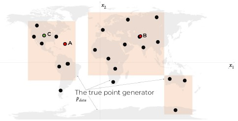
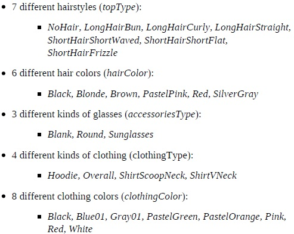
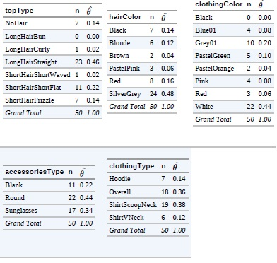
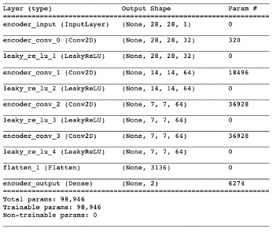
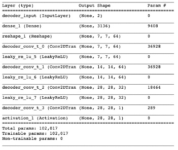
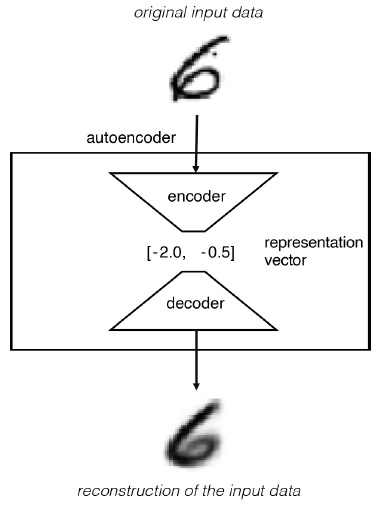
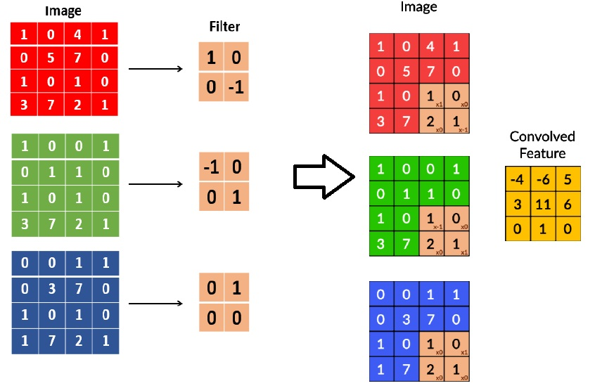
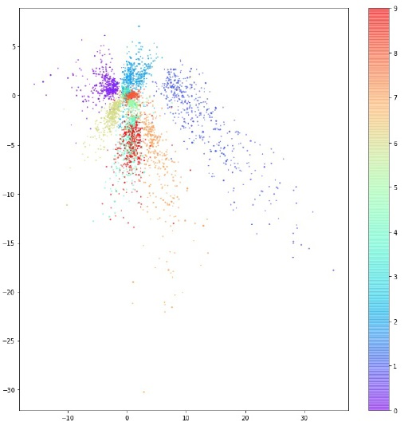
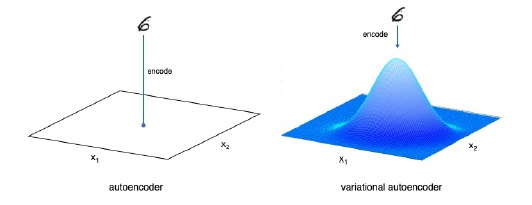
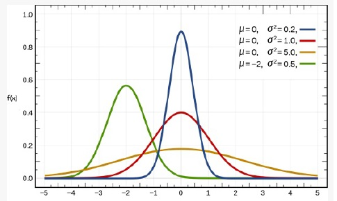

# Generative Deep Learning #
## Part 1 : Review Session ##
——————————————————————————————————————————

## Chapter 1 : Generative Modelling ##
- Generative Modelling Vs Discriminative Modelling
 - Discriminative modelling

    Estimates $p(y|x)$ $-$ the probability of a label $y$ given observation $x$
 - Generative modelling

    Estimates $p(x)$ $-$ the probability of observing the observation $x$. If the dataset is labeled, we can also build a generative model that estimates the distribution $p(x|y)$
    
- Generative Modelling Framework
 - Given some observations $(X)$, we assume that the observations have been generated from an unknown distribution $p_{data}$
 - The generative model, $p_{model}$, tries to mimic $p_{data}$. If we are able to build a good generative model, then we can sample from $p_{model}$ to generate observations that appear to have been drawn from $p_{data}$
 - Fundamental requirements for $p_{model}$
   - Rule 1 - It can generate examples that appear to have been drawn from $p_{data}$
   - Rule 2 - It can generate examples that are suitably different from the observations in $X$, that means, the model shouldn't simply reproduce things it has already seen (See exmaple below)



- <b style="color:black">Black dots : $p_{data}$</b>
- <b style="color:red">Red dots : Generated points</b>
- <b>Evaluation based on above *fundamental requirements</b>
 - Point A : Breaks *Rule 1*, as it appears to have generated in the middle of the sea.
 - Point B : Breaks *Rule 2*, as it is too similar to existing data $X$
 - Point C : Seems to be good generation, satisfying all fundamental requirements.

- <h3> Probabilistic Generative Models </h3>
 Some important terminologies to be considered
 
 - Sample Space
 - Probability Distribution Function $p(x)$ (Density Function)
 - Parametric Modelling : A family of density functions, for individual paramters that define the complete data $X$
 - Likelihood
   
   It is the probability of observing a parameter $\theta$ given a point $x$, represented as $L(\theta|x) = p_{\theta}(x)$. This is plausibility of $\theta$ given an observed point $x$. If we have a complete data $X$, then this plausibility would become
   
   $L(\theta|X) = \prod_{x \in X}p_{\theta}(x)$
   
   Since this computationally heavy, hence we use a logarithmic version of this as
   
   $l(\theta|X) = \sum_{x \in X}log(p_{\theta}(x))$
   
 - Maximum Likelihood Estimation
   Given the above likelihood definition, there can be a set/group of $theta$ parameters most likely explain the observed data $X$. Say these parameters are $\hat{\theta}$. So the formulation would be
   
   $\hat{\theta} = {argmax}_{\theta} L(\theta | X)$

 With the above fundamentals, lets consider following example

 There are 50 people, who have stated there fashion preferences as given below. The possible values of each parameter is also given below.
 
 
 
 
 Given the above case, there can be $7 x 6 x 3 x 4 x 8 = 4032$ possible combinations of the above features. We are given some 50 possible combinations in $X$.
 The maximum likelihood estimate of $\hat{\theta}$ for each parameter would be given by
 
 $\hat{\theta_{j}} = \displaystyle\frac{n_{j}}{N}$
 
 $n_{j}$ is the number of times a combination was observed in the dataset $X$ which has a total of $N = 50$ observations
 
 <b style="color:red">PROBLEM 1</b>
 
 Considering the above formulation, if a certain combination $(j)$ is never seen, the its $n_{j}$ would be zero (0) leading to maximum likelihood to be 0, and hence we would never be able to generate anything new. This is why we introduce some *pseudocount* in the calculation by changing the formula as
 
 $\hat{\theta_{j}} = \displaystyle\frac{n_{j} + 1}{N + d}$ -> N = 50 & d = 4031
 
 `
 MLT DISCUSSION
 We had some interesting QnA here. 
 Q1) If we are adding 1 in the numerator, why are we adding (d = 4031) in the denominator?
 (A) We can have 4031 possible combinations, out of which we already are given 50 combinations. If we add 1 in the numerator, then we are assuming that all possible combinations have atleast 1 occurence, and hence for ratio calculation, we add 4031 in the denominator as well.
 `
 
 <b style="color:red">PROBLEM 2</b>
 
 Even if we consider the above modified formulation, it is clear that the combinations which were not seen in the dataset still has same probability. Hence, the probability of an unnatural combination would also as possible as the possibility of natural combination which does not exist in the dataset.

- <h3> Naive Bayes based Generative Models </h3>
 In order to tackle the problems stated above, we move towards Naive assumption.

 ***Each feature $x_{k}$ is independent in nature, and exihibit no correlation with any other feature in the dataset $(X)$***

 Formally speaking

 $\displaystyle p(x_{k} | x_{j}) = p(x_{k})$ --> NAIVE ASSUMPTION

 We know that the $p(x)$, that is, probability of observing a point $(x)$ in the space, is the joint probability of all the concerning features which define the point $(x)$. Therefore, by using conditional probability and chain rule of probability we can say

 $
 \begin{aligned}
 p(x)&= p(x_1, x_2, x_3, \dots , x_K) \\
     &= p(x_2,x_3, \dots, x_K | x_1)p(x_1) \\
     &= \prod_{k=1}^{K}p(x_k | x_1, x_2, \dots x_{k-1})
 \end{aligned}
 $

 Based on Naive Assumption, the above formulation changes to

 $ 
 \begin{aligned}
 p(x) &= \prod_{k=1}^{K}p(x_k)
 \end{aligned}
 $ 

 <b style="color:red">Explanation</b>

 In the **Probabilistic Approach** we were taking the probabilities based on the complete combination of features. Which in-turn increased number of possible combinations as well, due to limited observable points from the data, we did could not elaborate the model to points which were not never seen. (even with smoothing). According to **Naive Assumption**, we have removed the combination element, by assuming independence. Now, for every feature, we calculate the probabilities for each feature (based on the multi-nomial aspect of each feature), and subsequently calculate the net probabilities based on equation above.

  

 Based on above, if we want to calculate the probability of a combination given below

 $
 \begin{aligned}
 p(LongHairStraight,Red,Round,ShirtScoopNeck,White)
 \end{aligned}
 $

 $
 \begin{aligned}
 &= p(LongHairStraight) p(Red)  p(Round) p(ShirtScoopNeck) p(White)\\
 &= 046 x 0.16 x 0.44 x 0.38 x 0.44 \\
 &= 0.0054
 \end{aligned}
 $

 By using this methodology, we can estimate the probability of those combinations that do not exist.

 <b style="color:red">PROBLEM 3</b>
 
 The problem with above approach is that, we have made an assumption that individual features are indepedent. When we use a multi-nomial data then it may be able to generate new set of data points which might be possible, however, when we are looking a large featured dataset, then inter-relationship between features cannot be ignored. 
 
 - How does the model cope with the high degree of conditional dependence between features?
 - How does the model find one of the tuny propotion of satisfying possible generated observations among a high-dimentional sample space?
 
- <h3> Representation Learning </h3>
 Representation learning, articulates that instead of modelling in high-dimentional space, we represent the data in lower dimentional latent space. Thereafter, we have a mapping function, which can re-create high-demintional data from a given laten space. For eg, in order to build cylinder, we need radius and height. However, if we are given only images of cylinders, then the idea would be infer the 2 dimensions (radius and height) from these images, and if we are able to infer them, then through a mapping function, we can always create a new cylinder given any 2 combinations of radius and height.
 
  
 
 `
 MLT DISCUSSION
 The question on Manifolds 
 Q1) ??
 (A) ??
 `

- <h4 style="color:blue">MLT Study Group Discussion Summary - Session #1 </h4>


- <h3> VARIATIONAL AUTO ENCODERS (VAE) </h3>

Variational encoders act as the fundamental building block for **Generative Adversarial Networks (GANs)**. Before, we move to VAEs, it is important o understand the building blocks of VAE, that ae encoders and decoders. The idea of encoders and decoders are aimed at building the **Representation Learning** that we discussed in the previous section. The core idea being representation of higher dimension space into lower dimension space, which is able to *represent* latent features. These representation learning aspects are built using **AUTO ENCODERS**. The fundamental building blocks of auto-encoders are:

 - Encoder
   
   An encoder network compresses high-dimensional input data into a lower dimension representation vector
   
   For eg: For images, we can use a standard **Conv2D** network to compress the information provided in images over multiple channels into a smaller representation at lower dimension space. Something like below
   
   
   
 - Decoder
 
   A decoder network decompresses given representation vector back to the original domain
   
   For eg: Continuing on the example, above, we use **Conv2DTranspose** network to expand from a lower dimension representation back to an image. Something like below
   
   
   
   `
   Note on Conv2DTranspose
   Conv2D layers impose filters which result in reduction of the input tensor (say using a stride = 2).
   Conv2DTranspose layers impose similar filters, however, but result in increase in input tensor size (say using a stride = 2)
   In Conv2DTranspose layer the strides parameter determines the internal zero padding between the pixels in the image.
   `
   
 Using the above **encoder/decoder** networks, the aim is to build something like below.
 
 
 
 <b style="color:blue"> The loss function for encoder-decoder network </b>
 
 We use a standard RMSE loss for the pixel values that the decoder predict.
 
 <b style="color:blue"> MLT discussion on Convolution</b>
 
 The way convolution works is by getting filters established for every input channel (say n = 3). Suppose the output channels are (N = 32), then we would need (n X N = 3 * 32) filters in total. If we each filter is 3x3 then we have $3 x 3 x 3 x 32$ filter weights and $32 bias$, so the total parameters become $(3 x 3 x 3 x 32) + 32 = 896$ parameters
 
 

 <h3> Analyzing an auto-encoder network </h3>
 Considering an auto-encoder used for images, and that too with MNIST dataset for numerical integers, we see that the distribution of representation looks like below. Note, that we used a representation vector length of 2, so ${x_1}$ and ${x_2}$ form the axis in the below representation diagram. Also, the colors represent the number/integer they represent
 
 
 
 - Inferences from above representations built
  1. The plot is not symmetrical about $(0,0)$, and not bounded too. 
  2. Some digits are represented over a very large area, and some are represented over a very small area.
  3. There are large gaps between colors containing few mins, that means, the clusters so being formed are not that coherent or to say tightly packed.
  
 <b style="color:red"> PROBLEM 4 </b>
 - Issues seen with the above representaions
  1. The original idea was to be able to choose a random point in the space represented and build a number out of that representation. However, the distribution is not uniform, and hence sampling from the sample space becomes problematic. Based on above, any point in that space should represent some digit, however, due to undefined behavior this ability is lost.
  2. Due to unbounded and undefined nature of the representation, if we take any point in the space represented, it will/may not result in a good image.
  3. When we have 2D representation, (that is smaller latent space - low dimension space), this problem is not that apparent. However, as the dimensions increase this would become even harder, because same digits would be represented in space in a manner that they would be very far off, and thus it would not be a proper laten space representation of the higher dimensions.
  
  <h3> Variational Autoencoder </h3>
  We noticed the problem above in a vanilla auto-encoder system. Variational Auto encoder systems aim at addressing those issues.
  In **auto-encoders** a single digit was mapped to a single point in the space.
  In **Variational Auto Encoder**, a single digit is mapped to a **multivariate normal distribution** around a point in latent space
  
  
  
  - Note on Normal Distrbution
   - Formally
   
     $\displaystyle f( x | \mu, \sigma^2) = \frac{1}{\sqrt{2\pi\sigma^2}}{\epsilon^{-\frac{(x-\mu)^2}{2\sigma^2}}}$
     
     The above is normal distribution in 1 dimensional space. (given the mean $(\mu)$ and $(\sigma^2)$)
     
   - Standard Normal Distrbution
     
     Standard normal distrbution has $(\mu = 0)$ & $(\sigma^2 = 1)$
     
     
     
     To sample any point from any of the distrbution given above, we would use the below formulation
     
     $ z = \mu + \sigma\epsilon $. **Remember : $\epsilon$ is sampled from a standard normal distribution**
     
   - Multi-variate normal distribution
     $\displaystyle f(x_1, x_2, \dots, x_n) = \frac{\epsilon^{-\frac{1}{2}(x-\mu)^T\sum{}{-1}(x-\mu)}}{\sqrt{(2\pi)^k\sum}}$


```python

```
