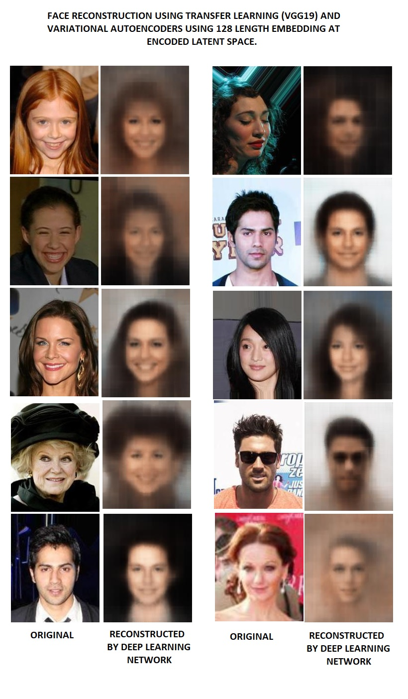
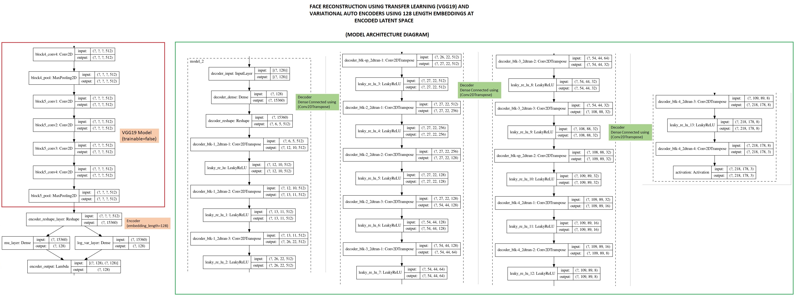

## Variational Auto Encoders ##

Variational Auto Encoders use 2 networks to build a lower dimensional latent space representation. Specifically for "image" data:
- Encoder Network
  - Aims to burn down 3 channel RGB images through a set of Convolution Layers to a compressed but higher channel representation, capturing high level features present in the image.
  - Finally, *flattening* the representation built to single vector
  - Feeding a the *flattened* representation to 2 parallel layers **mu_layer - (mean layer)** and **log_var_layer - (standard deviation layer)**
  - Finally combining the 2 parallel layers into a randomized representation of the image at reduced dimension latent space of "fixed" dimension length. In this case 128.
 
- Decoder Network
  - Aims to re-built the image using reduced dimension latent space (in this case 128), through a set of *Upsampling/Conv2DTranspose* layers.
  - Use RMSE as the *reconstruction loss* parameter
  - Use *KL-Divergence loss* as a way to tune the reduced dimension latent space to have justified representation of images.

## MLT Experiment - VGG19 based Variational Auto Encoders ##

In this experiment, we use *VGG19 pre-trained network* as part of the **ENCODER** network. We keep this as `trainable=false` and take output from `block5-pool` layer of the VGG19 network. *Flatten* this representation, and build the encoder further on as described above.

We build custom-built decoder network, to rebuilt image from the reduced dimension latent space, while building the loss calculations as described above.

### Results ###
We ran the experiment for just `EPOCHS=5` (due to unavailability of GPUs), and below of the sample predictions

</img>

### First level inference ###

At preliminary level what can be seen from the predictions is 

- The model is able to capture some high level representations of the faces. (Clarity is less but high level representation and reproducibility has been achieved)
- The model seems to be giving some high value to reproducing **EYES**, as we can see that the **EYES** have been reconstructed in much more clearer manner, as compared to other parts of the face.

#### FUN QUESTION ####

Is the model trying to work like a human mind, and trying to concentrate more on the eyes first, when it tries to reproduce a face? Do humans also do something similar when they reconstruct a person's image in their mind? May be possible, however, not always though. A point worth thinking about.

### Model Architecture (for reference) ###
</img>
